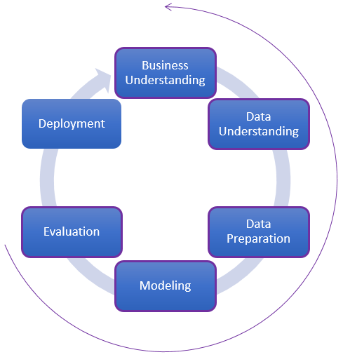

# **Cross-Industry Standard Process**

Le modèle de processus Cross-Industry Standard Process (CRISP) fournit la vue
d'ensemble du cycle de vie d'un projet Data Science. Il contient les phases d'un
projet, leurs tâches et les relations entre elles. Les relations peuvent exister
entre les tâches en fonction des données, de l'intérêt de l'utilisateur et,
surtout, des objectifs.

Le cycle de vie d'un projet se compose de six phases, illustrées sur la figure
1. La séquence des phases n'est pas rigide. Il est presque toujours nécessaire
de faire des retours entre les différentes phases. Le résultat de chaque phase
détermine quelle phase, ou tâche particulière d'une phase, doit être exécutée de
suite. Les flèches indiquent les dépendances les plus importantes et les plus
fréquentes entre les phases. Le cercle de la figure 1. symbolise la nature
cyclique de phases. Chaque projet d’après CRISP ne se termine pas une fois
qu'une solution est déployée. Les nouvelles informations obtenues au cours du
processus peuvent déclencher des nouvelles questions et générer des nouvelles
hypothèses. Les processus d'exploration et d’analyse de données ultérieurs
bénéficieront des expériences des précédents. Dans ce qui suit, nous décrivons
brièvement chaque phase.

Figure 1. Approche du Cross-Industry Standard Process

**Business Understanding**

Cette phase initiale est nécessaire pour comprendre les objectifs et les
exigences du projet d'un point de vue commercial, puis sert à convertir ces
connaissances à la définition des missions du projet et un plan préliminaire
conçu pour atteindre les objectifs.

**Data Understanding**

La phase de compréhension des données commence par la collecte des données
initiales et se poursuit par des activités qui permettent de familiariser avec
les données, d'identifier les problèmes de qualité des données, de découvrir les
premiers renseignements sur les données et / ou de détecter des sous-ensembles
intéressants.

**Data Preparation**

La phase de préparation des données contient toutes les activités nécessaires à
la construction de l'ensemble de données finale – données qui seront introduites
dans les outils de modélisation – à partir des données brutes initiales. Les
tâches de préparation des données sont susceptibles d'être effectuées plusieurs
fois et non dans un ordre prescrit. Les tâches incluent la sélection des tables,
des enregistrements et des attributs, ainsi que la transformation et le
nettoyage des données pour les outils de modélisation.

**Modeling**

Dans cette phase, diverses techniques de modélisation sont sélectionnées et
appliquées, et leurs paramètres sont calibrés aux valeurs optimales.
Habituellement, il existe plusieurs techniques pour le même type de problème
d'exploration de données. Certaines techniques ont des exigences spécifiques sur
la forme des données. Par conséquent, il est souvent nécessaire de revenir à la
phase de préparation des données.

**Evaluation**

Durant cet étape, le chercheur construit un modèle (ou des modèles) qui semble
avoir une haute qualité du point de vue de l'analyse des données. Avant de
procéder au déploiement final du modèle, il est important de bien l'évaluer et
de revoir les étapes exécutées pour le créer, afin de s'assurer que le modèle
atteint correctement les objectifs du client final.

**Deployment**

Généralement, la création du modèle n'est pas la fin du projet. Même si le but
du modèle est d'améliorer la connaissance sur des données, les connaissances
acquises devront être organisées et présentées de telle manière, que le client
puisse les utiliser. Il s'agit souvent d'appliquer des modèles « en direct »
dans les processus décisionnels d'une organisation. Selon les besoins, la phase
de déploiement peut être aussi simple que la génération d'un rapport ou aussi
complexe que la mise en œuvre d'un processus reproductible à l'échelle de
l'entreprise. Cependant, il est important que le client comprenne quelles sont
les actions à entreprendre pour utiliser les modèles déployés.

Next step : [Team Data Science Process](/TDSP.md)