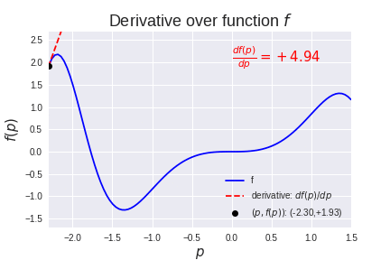
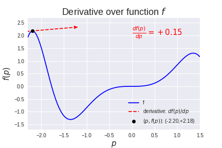
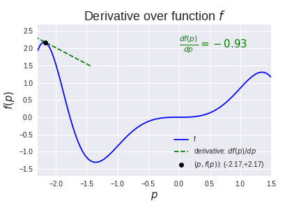
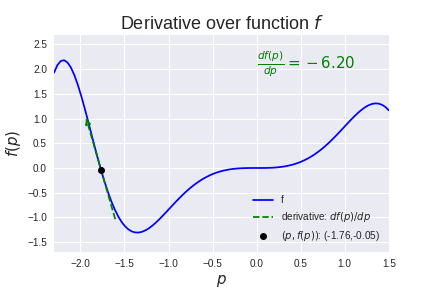
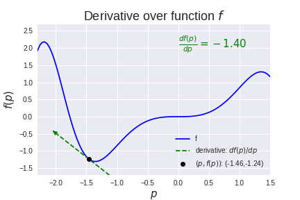
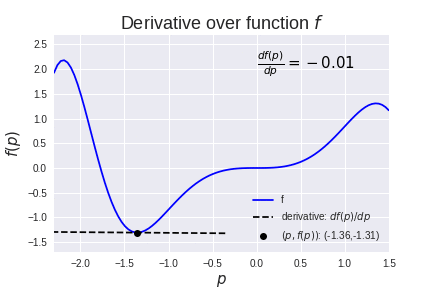
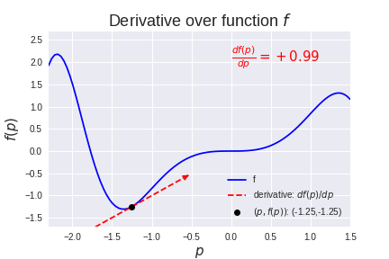
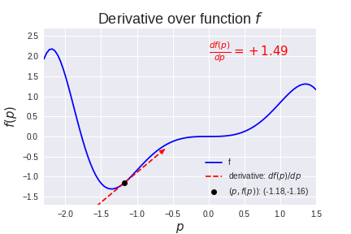

**Derivative**

The derivative of a function represents how the function changes with respect to
one of its parameters, and points in the direction of the increase of the
function. If we have a function *f* that has parameter *p*, then the
change, *df*, of the function *f* with respect to the change, *dp*, of the
parameter *p* is noted as *df(p)/dp*.

Useful :

[Gif animation](https://cdn-images-1.medium.com/max/1600/1*fAHaaT3I003D6tjZQzZ32Q.gif)

[Visual explanation](https://medium.com/onfido-tech/machine-learning-101-be2e0a86c96a)

[Essence of
calculus](https://www.youtube.com/playlist?list=PLZHQObOWTQDMsr9K-rj53DwVRMYO3t5Yr)

**Next Step** : [Loss Function](/Key%20Concepts/Loss%20Function.md)