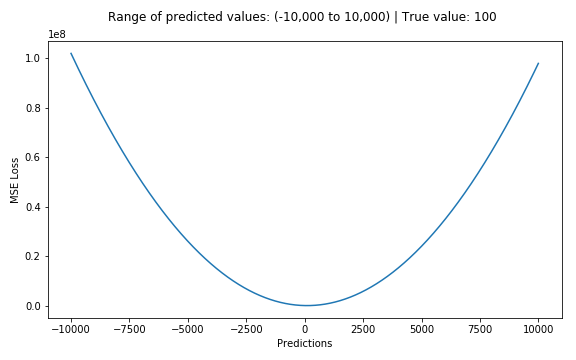

**Loss Function**

Evaluates how well specific algorithm models the given data. If predictions
deviate too much from actual results, loss function would cough up a very large
number. Gradually, with the help of some optimization function, loss function
learns to reduce the error in prediction.

There are various factors involved in choosing a loss function for specific
problem such as type of machine learning algorithm chosen, ease of calculating
the derivatives and to some degree the percentage of outliers in the data set.

Broadly, loss functions can be classified into two major categories depending
upon the type of learning task we are dealing with — Regression losses and
Classification losses :

-   In classification, we are trying to predict output from set of finite
    categorical values.

-   Regression, on the other hand, deals with predicting a continuous value.

n – Number of training examples

i – ith training example in a data set

 – truth label for ith training example

 – Prediction for ith training example.

! Regression functions predict a quantity, and classification functions predict
a label.

*Regression losses :* Mean Bias Error, Mean Squared Error, Mean Absolute Error,
Mean Absolute Percentage Error, Mean squared logarithmic error, Huber Loss /
Smooth Mean Absolute Error, Log cosh Loss, Poisson Loss.

*Classification losses :* Categorical Crossentropy, Binary crossentropy, Log
Loss, Focal Loss, Kullback (KL) Divergence / Relative Entropy, Exponential Loss,
Squared Hinge Loss, Hinge Loss

**Regression Losses**

*L1 Loss function*

Stands for Least Absolute Deviations. Also known as LAD.

*L2 Loss function*

stands for Least Square Errors. Also known as LS.

Generally, L2 Loss Function is preferred in most of the cases. But when the
outliers are present in the dataset, then the L2 Loss Function does not perform
well. The reason behind this bad performance is that if the dataset is having
outliers, then because of the consideration of the squared differences, it leads
to the much larger error. Hence, L2 Loss Function is not useful here. Prefer L1
Loss Function as it is not affected by the outliers or remove the outliers and
then use L2 Loss Function.

*Mean Bias Error*

}}{n}&space;$$)

Clearly there’s a need for caution as positive and negative errors could cancel
each other out.

*Mean Absolute Error / L1 Loss*

Mean absolute error is measured as the average of sum of absolute differences
between predictions and actual observations. MAE loss is useful if the training
data is corrupted with outliers.

*Mean Squared Error / Quadratic Loss / L2 Loss*

}^{2}}{n}&space;$$)

Mean square error is measured as the average of squared difference between
predictions and actual observations. The most commonly used regression loss
function.

! In short, using the squared error is easier to solve, but using the absolute
error is more robust to outliers.

*Mean absolute percentage error*

}*100&space;$$)

*Mean squared logarithmic error*

*Log cosh*

)&space;$$)

&space;=&space;\frac{\exp\left(&space;t&space;\right)&space;&plus;&space;exp(&space;-&space;t)}{2}&space;$$)

Advantage : works mostly like the mean squared error, but will not be so
strongly affected by the occasional wildly incorrect prediction. It has all the
advantages of Huber loss, but unlike Huber loss it’s twice differentiable
everywhere (For ML frameworks like XGBoost, twice differentiable functions are
more favourable).

*Huber Loss / Smooth Mean Absolute Error*

Huber loss is less sensitive to outliers in data than the squared error loss.
It’s also differentiable at 0. It’s basically absolute error, which becomes
quadratic when error is small. How small that error has to be to make it
quadratic depends on a hyperparameter, 𝛿 (delta), which can be tuned. Huber loss
approaches MAE when 𝛿 \~ 0 and MSE when 𝛿 \~ ∞ (large numbers.)

The choice of delta is critical because it determines what you’re willing to
consider as an outlier. Residuals larger than delta are minimized with L1 (which
is less sensitive to large outliers), while residuals smaller than delta are
minimized “appropriately” with L2.

*Poisson*

Poisson loss function is a measure of how the predicted distribution diverges
from the expected distribution.

)}&space;$$)

**Classification Losses**

*Hinge Loss / Multi class SVM Loss*

The hinge loss is used for “maximum-margin” classification, most notably for
support vector machines (SVMs).

}&space;$$)

*Squared Hinge Loss / Squared Multi class SVM Loss*

 𝛜 {-1,1}

)^{2}}&space;$$)

*Cross Entropy Loss / Negative Log Likelihood / Binary Cross Entropy*

This is the most common setting for classification problems. Cross-entropy loss
increases as the predicted probability diverges from the actual label.

&space;&plus;&space;\left(&space;1&space;-&space;y_{i}&space;\right)\log\left(&space;1&space;-&space;{\hat{y}}_{i}&space;\right)\rbrack}&space;$$)

In short, we are just multiplying the log of the actual predicted probability
for the ground truth class.

*Kullback (KL) Divergence / Relative Entropy*

KL Divergence, also known as relative entropy, information divergence/gain, is a
measure of how one probability distribution diverges from a second expected
probability distribution.

\rbrack}&space;=&space;\frac{1}{n}\sum_{i&space;=&space;1}^{n}{\left(&space;y_{i}*\log\left(&space;y_{i}&space;\right)&space;\right)&space;-&space;\frac{1}{n}\sum_{i&space;=&space;1}^{n}{(y_{i}*\log\left(&space;{\hat{y}}_{i}&space;\right))}}&space;$$)

References :

<https://towardsdatascience.com/common-loss-functions-in-machine-learning-46af0ffc4d23>

<https://heartbeat.fritz.ai/5-regression-loss-functions-all-machine-learners-should-know-4fb140e9d4b0>

<https://isaacchanghau.github.io/post/loss_functions/>
