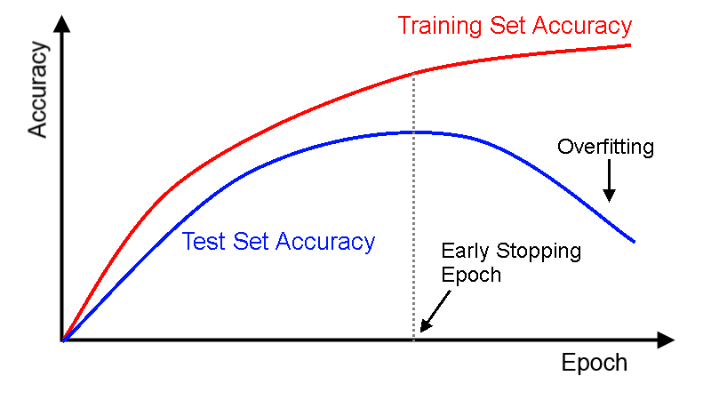

**Requirements**

[/Methodology/Key Concepts/Loss Function](/Key%20Concepts/Loss%20Function.md)

**Over-fitting**

Over-fitting - In statistics, overfitting is the production of an analysis that
corresponds too closely or exactly to a particular set of data and may therefore
fail to fit additional data or predict future observations reliably ([Definition of Overfitting at OxfordDictionaries.com](https://en.oxforddictionaries.com/definition/overfitting)).

The green line represents an overfitted model and the black line represents a regularized model. While the green line best follows the training data, it is too dependent on that data and it is likely to have a higher error rate on new unseen data, compared to the black line.

Noisy (roughly linear) data is fitted to a linear function and a polynomial function. Although the polynomial function is a perfect fit, the linear function can be expected to generalize better: if the two functions were used to extrapolate beyond the fitted data, the linear function should make better predictions. If the number of parameters is the same as or greater than the number of observations, then a model can perfectly predict the training data simply by memorizing the data in its entirety. Such a model, though, will typically fail severely when making predictions. |   |

To lessen the chance of, or amount of, overfitting, several techniques are available : model comparison, cross-validation, regularization, early stopping, pruning, dropout, etc.

**Cross-validation (out-of-sample testing)**

Is a method for evaluating an analytical model and its behavior on independent
data. In evaluating the model, the available data is divided into k parts. Then,
the model is trained on the k − 1 parts of the data, and the rest of the data is
used for testing. The procedure is repeated k times; as a result, each of the k
pieces of data is used for testing. The validation results are combined (e.g.
averaged) over the rounds to give an estimate of the model’s predictive
performance.

[Source](https://medium.com/@sebastiannorena/some-model-tuning-methods-bfef3e6544f0)

**Regularization**

Regularization in statistics, machine learning, inverse problem theory is a
method of adding some additional information to a model in order to prevent
overfitting. This information often has a kind of penalty for the complexity of
the model.

The green and blue functions both incur zero loss on the given data points. A
learned model can be induced to prefer the green function, which may generalize
better to more points drawn from the underlying unknown distribution

**Early stopping**

When training a model, there will be a point during training when the model will
stop generalizing and start learning the statistical noise in the training
dataset. This overfitting of the training dataset will result in an increase in
generalization error, making the model less useful at making predictions on new
data. The challenge is to train the model long enough that it is capable of
learning the mapping from inputs to outputs, but not training the model so long
that it overfits the training data.

While the network seems to get better and better, i.e., the error on the
training set decreases, at some point during training it actually begins to get
worse again, i.e., the error on unseen examples increases.

One approach to solving this problem for DNN is to treat the number of training
epochs as a hyperparameter and train the model multiple times with different
values, then select the number of epochs that result in the best performance on
the train or a holdout test dataset.

The downside of this approach is that it requires multiple models to be trained
and discarded. This can be computationally inefficient and time-consuming,
especially for large models trained on large datasets over days or weeks.

**Pruning**

Pruning is a technique in machine learning that reduces the size of decision
trees by removing sections of the tree that provide little power to classify
instances. Pruning reduces the complexity of the final classifier, and hence
improves predictive accuracy by the reduction of overfitting.

One of the questions that arises in a decision tree algorithm is the optimal
size of the final tree. A tree that is too large risks overfitting the training
data and poorly generalizing to new samples. A small tree might not capture
important structural information about the sample space. However, it is hard to
tell when a tree algorithm should stop because it is impossible to tell if the
addition of a single extra node will dramatically decrease error. A common
strategy is to grow the tree until each node contains a small number of
instances then use pruning to remove nodes that do not provide additional
information.

One of the simplest forms of pruning is reduced error pruning. Starting at the
leaves, each node is replaced with its most popular class. If the prediction
accuracy is not affected, then the change is kept. While somewhat naive, reduced
error pruning has the advantage of simplicity and speed.

**Dropout**

The main idea of Dropout is, instead of learning one DNN, to train an ensemble
of several DNNs, and then to average the results obtained. Networks for training
are obtained by dropping out neurons with probability *p*, so the probability
that a neuron will remain in the network is *q = 1 - p*. The “exception” of a
neuron means that it returns 0 for any input data or parameters
[Source](https://habr.com/en/company/wunderfund/blog/330814/).

A graphical representation of the dropout method, taken from the article in
which it was first introduced. (a) the neural network before Dropout was applied
to it ; (b) the same network after dropout.
