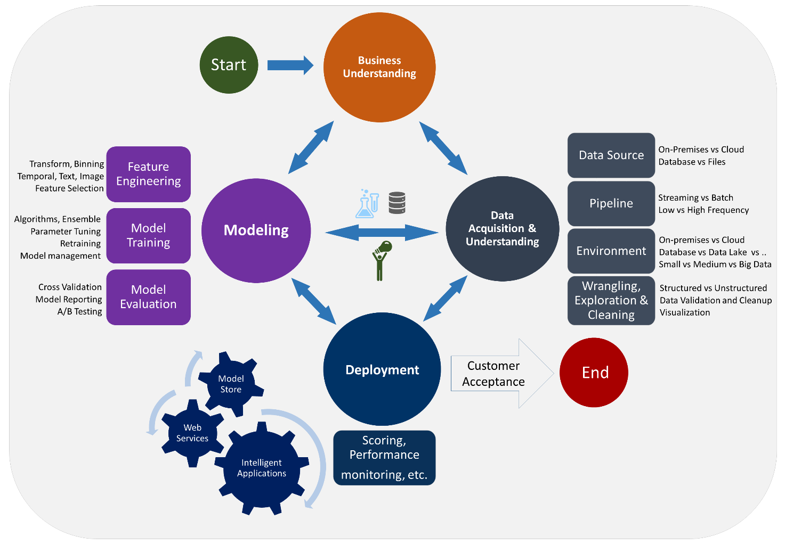
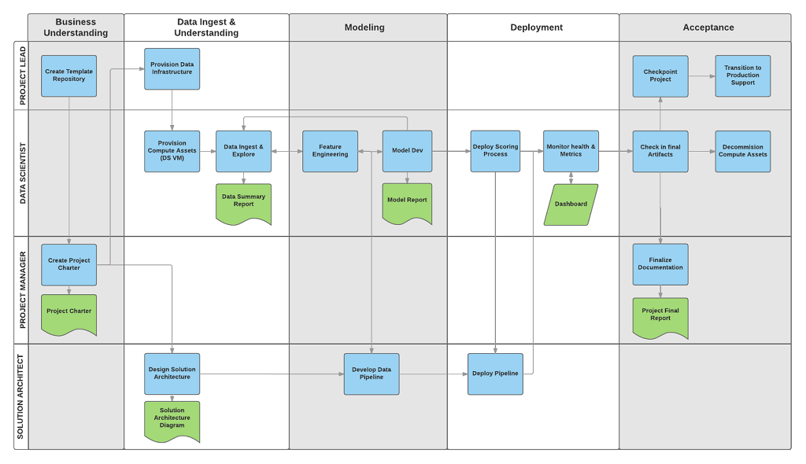

**Requirements**

/Methodolody/CRISP.docx

**Team Data Science Process**

Team Data Science Process (TDSP) fournit une approche systématique pour la
création d’applications intelligentes qui permettent aux équipes de chercheurs
de données de collaborer dans les meilleures conditions tout au long du cycle de
vie des activités nécessaires à la conversion de ces applications en produits.
Le cycle de vie présente les étapes, que les projets suivent généralement. Il
faut noter, qu’à haut niveau, CRISP et TDSP ont beaucoup en commun.

Ce cycle de vie a été conçu pour les projets de sciences des données intégrés à
des applications intelligentes. Ces applications déploient des modèles
d’apprentissage automatique ou d’intelligence artificielle pour l’analytique
prédictive. Les projets de sciences des données exploratoires et les projets
d’analytique ad hoc peuvent également tirer parti de ce processus. Mais, dans ce
cas, certaines des étapes décrites peuvent s’avérer superflues.

Figure 1. Approche du Team Data Science Process

Le cycle de vie décrit les étapes majeures que les projets exécutent
généralement, souvent de manière itérative : présentation et compréhension de
l’activité de l’entreprise, acquisition de données et compréhension,
modélisation, déploiement, acceptation du client. La représentation visuelle du
cycle est disponible sur la figure 2.

Les tâches et artefacts de documentation de chaque phase du cycle de vie TDSP
sont associés à des rôles de projet :

-   architecte de solution ;

-   chef de projet ;

-   data scientist ;

-   coordinateur de projet.

Figure 2. Cycle de vie du processus TDSP

La représentation visuelle de ces tâches et artefacts est présentée sur la
figure 3.

Figure 3. Grille des tâches (en bleu) et des artefacts (en vert) associés à
chaque étape du cycle de vie **du processus TDSP** (sur l’axe horizontal) pour
ces rôles (sur l’axe vertical)
